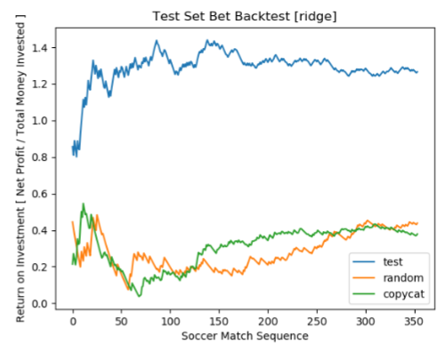

#### 1. [Stock Price Correlation Coefficient Prediction](#stock-price-correlation-coefficient-prediction)  
#### 2. [Soccer Match Result Prediction and its Application](#soccer-match-result-prediction-and-its-application)

---

## Stock Price Correlation Coefficient Prediction

paper : [Stock Price Correlation Coefficient Prediction with ARIMA LSTM Hybrid Model](https://arxiv.org/pdf/1808.01560.pdf)  
codes : [github repo](https://github.com/imhgchoi/ARIMA-LSTM-hybrid-corrcoef-predict)

   
  
* **Why do we need to compute the correlation coefficients for investment?**  

According to Harry Markowitz's Modern Portfolio Theory, we normally assess the stock portfolio's risk as follows.
    

$$
\sigma_p = w^2_i\sigma^2_i + w^2_j\sigma^2_j + 2w_iw_j\sigma_i\sigma_j\rho_{ij}
$$

  

where $w_i$ and $w_j$ be the weights assigned to each asset in the portfolio, $\sigma_i$ and $\sigma_j$ the historical
standard deviation, and $\rho_{ij}$ the correlation coefficient of those two.
  
    
 
* **How do we predict correlation coefficients?**

Here, various methods have been used to estimate the correlation coefficient value $\rho_{ij}$.  
One of the most simplest and common method used is what so called the **Full Historical Model**. The model assumes that
the correlation coefficient will be identical to the historical value. Thus, the equation,
    

$$
\hat{\rho}^{(t)}_{ij} = \rho^{(t-1)}_{ij}
$$

    

Several other models for correlation coefficient prediction include...  
the **Constant Correlation Model**
    

$$
\hat{\rho}_{ij}^{(t)} = \frac{\displaystyle \sum_{i>j} \rho_{ij}^{(t-1)}} {\displaystyle n(n-1) / 2}
$$

where $n$ is the number of assets in the portfolio,
    

the **Single-Index Model**
    

$$
\hat{\rho}_{ij}^{(t)} = \frac{\displaystyle \beta_i \beta_j \sigma_m^2} {\displaystyle \sigma_i \sigma_j}
$$

where $\beta_i$/$\beta_j$ are the beta value for stock item $i$, and $\sigma_m$ is the market's volatility,
    

the **Multi-Group Model**
    

$$
\hat{\rho}_{ij}^{(t)} = \begin{cases}
\frac{\displaystyle \sum_{i \in \alpha}^{n_\alpha} \sum_{j \in \beta ; i \neq j}^{n_\beta} \rho_{ij}^{(t-1)}} {\displaystyle n_\alpha (n_\beta - 1)}, \hspace{2mm} \text{where  $\alpha$ = $\beta$}\\
\frac{\displaystyle \sum_{i \in \alpha}^{n_\alpha} \sum_{j \in \beta ; i \neq j}^{n_\beta} \rho_{ij}^{(t-1)}} {\displaystyle n_\alpha  n_\beta}, \hspace{2mm} \text{where $\alpha$ $\neq$ $\beta$}
\end{cases}
$$

where $\alpha$ and $\beta$ notation here denotes the industry sector, and $n_\alpha$ and $n_\beta$ is the total number
 of assets in the corresponding industry sector.
    

You may refer to the paper's section 2, "Various Financial Models for Correlation Prediction" for more detailed 
elaboration for each model.
    
    
 

   
  
* **Room for Improvements?**  

The above models only consider linearity in their predictions. However, the financial data are innately non-linear,
thus calling for non-linear models for its correlation coefficient predictions. In my project paper, I proposed to
adopt the ARIMA-LSTM hybrid model to capture both linearity and non-linearity in prediction.  
Note that the ARIMA-LSTM model was originally proposed in 2003 by G.P. Zhang, in his paper "[Time series forecasting using a hybrid ARIMA 
and neural network model](https://www.sciencedirect.com/science/article/abs/pii/S0925231201007020)".

The ARIMA sector renders a linear prediction on the stream of correlation coefficients precomputed with a fixed-sized 
sliding window. The order for each time series is selected dynamically based on its AIC values. Then, the residual value
for each time step is computed, which becomes the input for the next LSTM RNN sector.
 

 
LSTM Cell Architecture

    
 
For prediction, The ARIMA model and the LSTM RNN model each predicts the future (linearity-based) correlation coefficient
and (non-linearity-based) residual value. The two predictions are added to render the final correlation coefficient value.
   
    
  
* **Experiment Results**

The model was tested against the formerly mentioned financial predictive models. The performance indices indicate that
the ARIMA-LSTM hybrid model outperforms all the other models.

    

To test for robustness, I iteratively tested the model on different combinations of 10 stock assets as well.

    
  
It seems that the ARIMA-LSTM hybrid model has a clear edge in predicting the future correlation coefficient of a pair
of stock assets.
  
## Soccer Match Result Prediction and its Application

report : [Soccer Match Result Prediction and its Application](https://github.com/imhgchoi/imhgchoi.github.io/raw/master/assets/docs/Soccer_Match_Prediction.pdf)  
slides : [PPT Slides](https://github.com/imhgchoi/imhgchoi.github.io/raw/master/assets/docs/Soccer_ppt.pdf)  
codes : [github repo](https://github.com/imhgchoi/soccer-match-predict)  

Note that this project was led as a team for an undergraduate Machine Learning [COSE362-2019F] course. The following
are the github links of those who were my teammates :  
   * [HyunHo Choi](https://github.com/chlgusgh715)
   * [JaeHyun Lee](https://github.com/LEE-JAE-HYUN179)
   * [JiHwan Park](https://github.com/thepark96)
   * [JuHyeon Shin](https://github.com/juhyeon1212)
    
    
      

   
  
* **Our Motivations**

The sports betting market has been steadily growing for the past ten years, and the trend is still on-going. 
Currently, the international sports betting market is presumed to have a market capitalization of $250 billion. In 
such a huge sports betting market, we believed that we could expect a greater profit through machine learning models.
Thus, we aimed to build various machine learning models **_from-scratch_**, compare their performances in terms of
F1 measure and Return On Investments (ROI), and assess its profitability in a simulated betting environment.

   
  
* **What Data Did We Use?**

We utilized the England Premier League datasets publicly available on [Football-Data.co.uk](https://football-data.co.uk/englandm.php). 
The dataset contain information for each EPL soccer match from year 2008 to 2018. We largely refered to Andrew Carter's
 [blog post](http://andrew.carterlunn.co.uk/programming/2018/02/20/beating-the-bookmakers-with-tensorflow.html) when
 preprocessing our data.  
 In order to both utilize classifiers and regression models, we created two different types of target variables :
 match score and winning teams. i.e. regression models are trained to predict actual scores, whereas classifiers are
 trained to predict whether the winner of the game would be the home team / away team / draw. 
 
    
   
* **Models We Built _from-scratch_**

The list of models we built from-scratch is as follows :

     * Vanilla Linear Regression
     * Linear Ridge Regression
     * Logistic Regression
     * Gaussian Kernel Regression
     * K-Nearest Neighbors Regrssor/Classifier
     * Linear Support Vector Machine Classifier
     * Multi-Layer Perceptron Classifier

The regression models' outputs were converted to a classification problem for convenience in evaluation. For instance,
if the model predicted a score of 3:1 for Home versus Away, this was converted to "Home Wins".  

_Check out our project report for details!_

   
  
* **So... Are We Makin' Money?**

    
  
> Note that BL-SVM and BL-MLP stands for Baseline-SVM and Baseline-MLP. These are our baseline models from 
 our reference, G. Kumar's masters thesis "[Machine Learning for Soccer Analytics](https://www.researchgate.net/publication/257048220_Machine_Learning_for_Soccer_Analytics)".
 And also note that this may **NOT** be a proper baseline in that the data, experiment environment, model hyperparameters
 were different, and we did not re-implement the models (i.e. the raw performance indices were taken from the paper).

For convenience, we plotted a scatter-plot with the F1-score on the x axis, and the ROI on the y axis.

    
  
We concluded that the Ridge Regression model performed best overall, and thus carried out a backtest for betting on the
model.

    

> The Random model randomly selects a winning team for bet. And the Copycat model accesses the betting odds and selects
the team with the lowest odds; thus, the team which the most people betted on.

The Ridge Regression model performed way better than the random model and the copycat model in terms of Return On Investment.
Although we later came to know that bets are usually made in bundles - that is, you need to correctly predict multiple
games' results correctly to win the bet - we were pleased to know that our model performed superior to our benchmarks.
